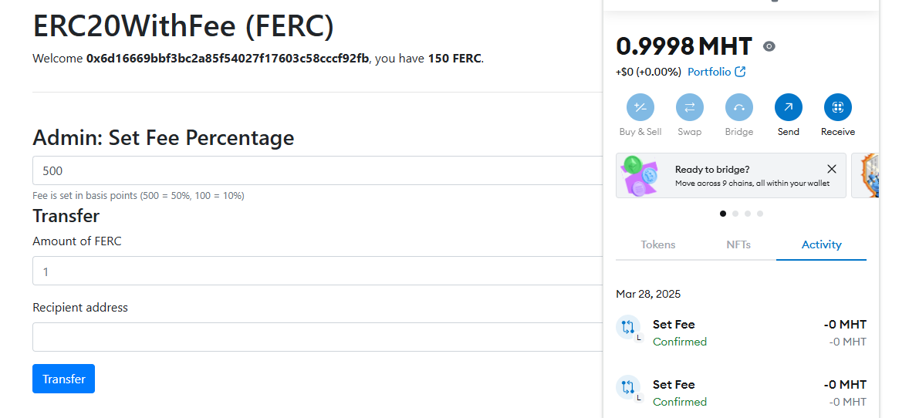
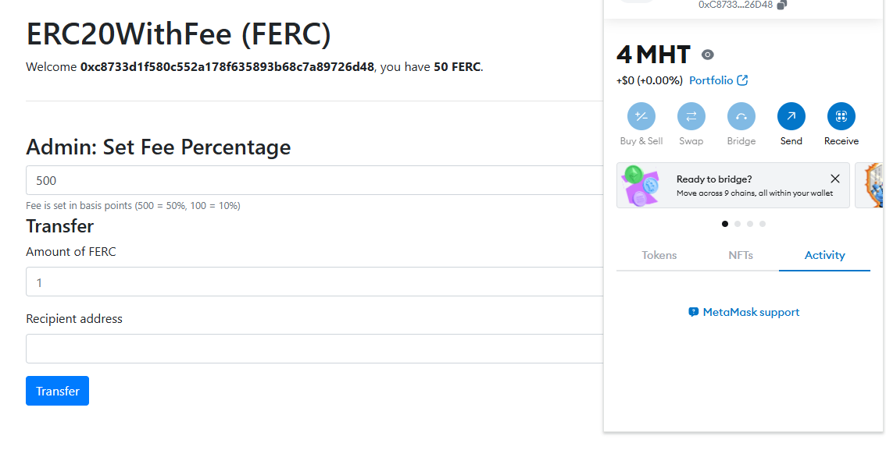
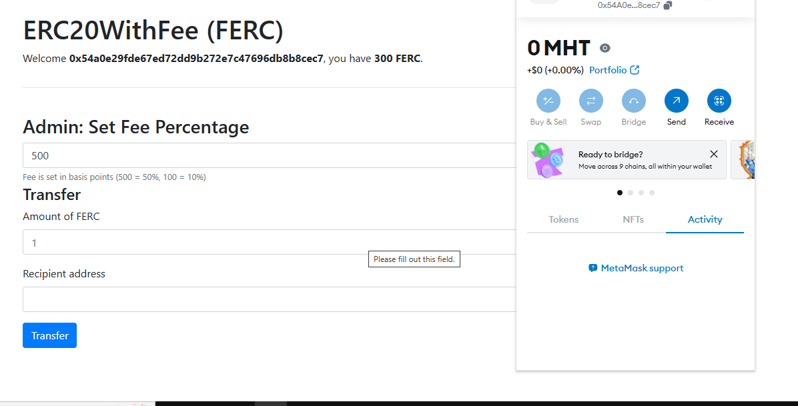
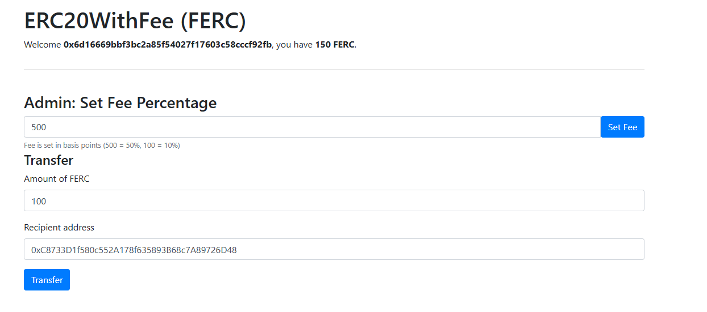
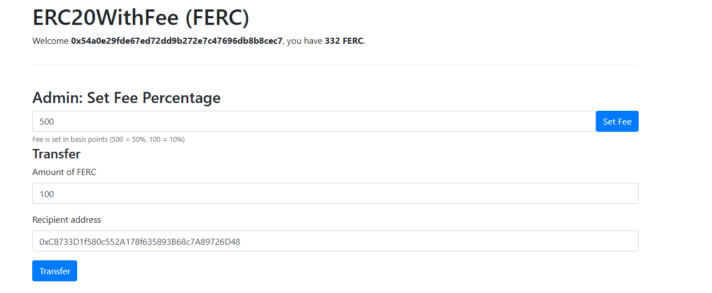
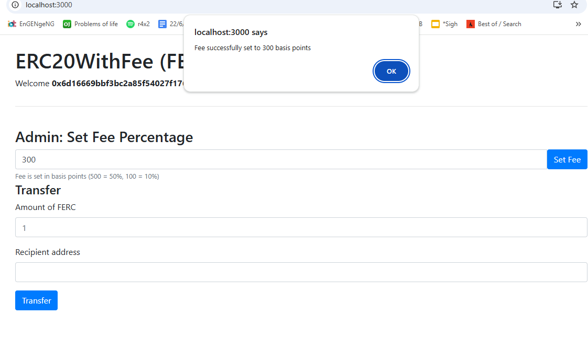
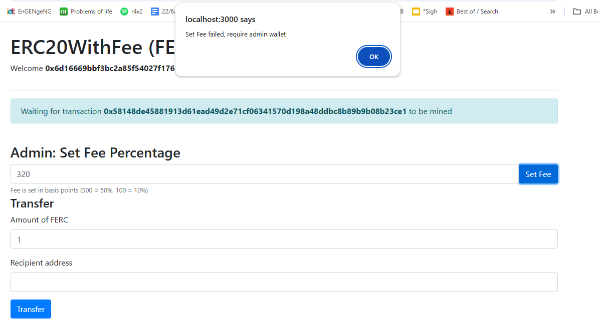
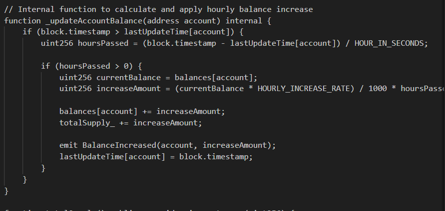

# midterm_blockchain

## Add transaction fee to 3rd wallet
Firstly, i will demo the fee collect system, i will try to send 100 FERC from source to receiver with 32% transaction fee, this mean after the transaction, the receiver will receive 68 FERC and the collector receive 32 FERC, please note the balance after that

  
   
  <em>Figure 1: Initial Source Wallet</em>

  
   
  <em>Figure 2: Initial Receiver Wallet</em>

  
   
  <em>Figure 3: Initial Collector Wallet</em>

  
   
  <em>Figure 4: The transaction</em>

  
   
  <em>Figure 5: The collector balance after the transaction</em>

## Set Fee
I have coded the set fee system - only admin (network owner) can set fee, otherwise it will display an error

  
   
  <em>Figure 6: Set Fee sucessfully</em>

  
   
  <em>Figure 7: Set Fee Failed</em>

## Set hourly income
I do not know how should i can display a demo for this, i think i will briefly describe my code and explain what i am trying to do here

  
   
  <em>Figure 8: The Code</em>

Here i am trying to create a timestamp - which record the last time this account updated, the hourly income will updated automatically when we call the BalanceOf function, it also update the involved account when a transaction between them happen. I have set the interest rate to be 0.1% hourly.
